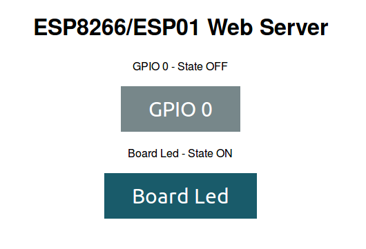

# esp01_webserver

Sample code for a ESP01 with webserver and relay control

## Required hardware

- ESP01 board
- Relay module

## Features

- Control GPIO0 and Led Board 
- WiFi connection using HTTP and 2 control buttons

## Default values

- LED Board and relay ON

## Feedback

If you have any questions or suggestions for improvement open an issue and we will improve this code together.

